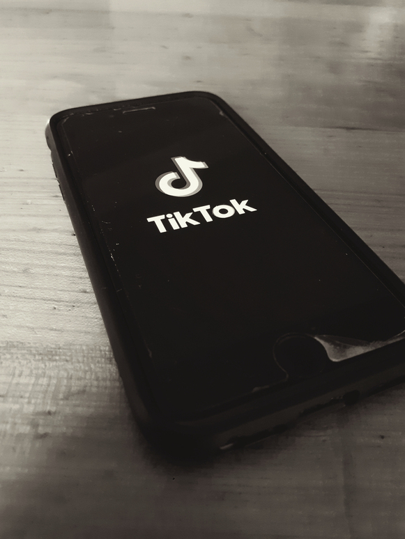

+++
title = "TikTok: die App die ihre Nutzer besser kennt als sie selbst"
date = "2023-05-08"
draft = false
pinned = false
image = "tik-tok-bild-3-1-.jpg"
description = ""
footnotes = "\n\n# Quellen\n\n \n\n\\- [TikTok - schneller Aufstieg trotz viel Kritik | tagesschau.de](https://www.tagesschau.de/wirtschaft/tiktok-147.html)\n\n\\- [ 2022: Kennzahlen und Statistiken aus Deutschland und der Welt (digimind.com)](https://blog.digimind.com/de/tiktok-2022-kennzahlen-und-statistiken-aus-deutschland-und-der-welt)\n\n\\- [TikTok hat 2022 weltweit über 1,5 Mrd. Nutzer - ftd.de](https://www.ftd.de/finanzen/aktien-und-maerkte/tiktok-hat-2022-weltweit-ueber-15-mrd-nutzer/)\n\n\\- [Gesellschafts-Studie: Die kollektive Aufmerksamkeit nimmt ab - Forschung & Lehre (forschung-und-lehre.de)](https://www.forschung-und-lehre.de/forschung/die-kollektive-aufmerksamkeit-nimmt-ab-1689/)\n\n\\- [Kurzvideos als Marketinginstrument | TEAM LEWIS](https://www.teamlewis.com/de/magazin/short-and-simple-kurzvideos-als-marketing-instrument/)\n\n\\- [Tik Tok und die psychologischen Auswirkungen - Gedankenwelt](https://gedankenwelt.de/tik-tok-die-psychologischen-auswirkungen-dieser-plattform/)\n\n\\- [Social Media Bubbles, Our Virtual Comfort Zone (byarcadia.org)](https://www.byarcadia.org/post/social-media-bubbles-our-virtual-comfort-zone#:~:text=Media%20bubbles%2C%20or%20social%20media%20bubbles%2C%20are%20defined,points%20of%20view%20%28%E2%80%9CDefinition%20of%20Media%20Bubble%2C%E2%80%9D%20n.d.%29.)\n\n\\- [Welche Länder haben TikTok verboten und warum? | Euronews](https://de.euronews.com/next/2023/03/20/welche-lander-haben-tiktok-verboten-und-warum)\n\n\\- [TikTok’s ties to China: why concerns over your data are here to stay | Data protection | The Guardian](https://www.theguardian.com/technology/2022/nov/07/tiktoks-china-bytedance-data-concerns)\n\n\\- [(66) How TikTok's Algorithm Figures You Out | WSJ - YouTube](https://www.youtube.com/watch?v=nfczi2cI6Cs&ab_channel=WallStreetJournal)"
+++
##### **TikTok Milliarden Verdiener und Ziel für Kritik. Was steckt hinter der App und wie viel weiss sie wirklich über ihre Nutzer?**

**Eine Reportage von Marty Kohlhoff**

Nach dem erstmaligen Öffnen bombardiert einen TikTok mit Tänzen, Memes, Challenges und anderen scheinbar wahllos zusammengestellten Videos. Nach einer Weile jedoch werden die angezeigten Inhalte viel geordneter und interessanter. Die App zeigt dem Benutzer nach und nach immer mehr Inhalte an, die einem gefallen. Immer mehr und mehr Zeit vergeht, bis der Benutzer merkt, huch es ist ja schon eine Stunde vergangen, dabei waren die Inhalte am Anfang noch so uninteressant. Es ist fast schon so, als könnte die App die Gedanken des Konsumenten lesen. Aber das kann sie natürlich nicht. Oder?

Die im Vergleich noch relativ junge Social-Media-Plattform hebt ab wie noch keine andere vor ihr. TikTok hatte im Jahr 2022 1,5 Milliarden Nutzer. Damit hat sie Instagram, welche zuletzt im Jahr 2018 eine Milliarde Nutzer verzeichnete, weit übertroffen. TikToks Zuwachs an kulturellem Einfluss ist einzigartig. Die App gewinnt weiterhin eine unglaubliche Anzahl an Nutzern und das, obwohl dem Entwickler Byte Dance durch die verschärften Regulierungsmassnahmen in Indien rund etwa 500 Millionen Nutzer verloren gegangen sind. Besonders im Hinblick auf die grosse Konkurrenz auf dem Social Media Markt wie Facebook, YouTube oder Instagram ist TikToks Erfolg eindrucksvoll. Das kann man insbesondere auch daran sehen, dass immer mehr Social Media Entwickler wie Meta oder Google mit Instagram Reels oder YouTube Shorts Kopien von TikTok auf den Markt bringen.

> ***«Man findet immer etwas Neues. Es ist halt unendlich.»***

Der grosse Erfolg TikToks liegt im ausgeklügelten Algorithmus der App. Man kann sich TikTok, wie eine grosse 3-dimensionale Karte vorstellen, von deren Zentrum tausende kleine Zweige abgehen, die Subkulturen darstellen. Im Zentrum dieser Karte stehen die beliebtesten Videos der Plattform, also jene bei denen die Wahrscheinlichkeit am grössten ist, dass ein neuer Benutzer darauf anspringt. Durch das Messen der Zeit, die ein Benutzer auf einem Video verbringt, lernt die App langsam, welche Videos dem Benutzer gefallen. Durch dieses Vorgehen teilt der Algorithmus den Benutzer immer weiter am Rand der Karte in Subkulturen ein und versorgt den Nutzer mit einem schier endlosen Vorrat an Unterhaltung. *«Man findet immer etwas Neues. Es ist halt unendlich.»* So beschrieb eine jugendliche Nutzerin die Wirkung von TikTok.

Was TikTok ebenfalls von anderen Social-Media-Plattformen unterscheidet, ist das Format der Videos. Die Videos auf TikTok sind viel kürzer als auf anderen Social-Media-Plattformen, wie zum Beispiel YouTube. Laut Dominique Wirz, einer wissenschaftlichen Mitarbeiterin und Oberassistentin im Departement für Kommunikation und Medienwissenschaft der Universität Freiburg, verleitet das kürzere Format der Videos dazu, mehr Zeit auf der App zu verbringen als das beim vorhin erwähnten Beispiel YouTube und anderen Social-Media-Plattformen der Fall ist. Eine weitere Wirkung, die dem Kurzvideo Format oft zugesprochen wird, ist, dass diese die Aufmerksamkeitsspanne verkürzen sollen. Dies ist jedoch nur eine These. Es wurde nur bewiesen, dass die Aufmerksamkeit der Gesellschaft als ganzes sinkt. Dominique meint dazu, das sei Gewohnheitssache. Es hänge davon ab, wie man lernt, Informationen zu verarbeiten. *«Man lernt quasi mit der Umgebung zu arbeiten, in der man arbeitet.»*, so Dominique. Die Aufmerksamkeitsspanne von Personen sei zwar verkürzt, dafür wären diese laut Dominique jedoch in der Lage, Informationen schneller zu verarbeiten. Das kann aber im Gegenzug jedoch dazu führen, dass solche Personen es dann schwierig oder sogar störend empfinden, länger zum Beispiel Vorlesungen zuzuhören. *«Man sollte das nicht so problematisieren»*, meint Dominique. Denn schlussendlich würde sich Menschen an die Fähigkeiten gewöhnen, die sie brauchen.

Was jedoch eine grössere Gefahr darstellen kann, sind die sogenannten Social Media Bubbles. Als Social Media Bubble bezeichnet man eine Umgebung, in der die Aussetzung einer Person zu Nachrichten, sozialen Medien, Unterhaltung, etc. nur einen ideologischen oder kulturellen Standpunkt aufweist, wodurch andere Ansichten falsch dargestellt werden. Dieses Phänomen wird auch virtuelle Komfortzone genannt. Die Gefahr in eine solche Bubble zu gelangen ist auf TikTok deutlich höher als auf anderen Social-Media-Plattformen, da die Inhalte schnell sehr repetitiv werden können. Rund 93 Prozent der angezeigten Inhalte sind sehr ähnlich. Die restlichen 7 Prozent sind andere Inhalte, um den Benutzer auf neue Gedanken zu bringen oder Werbung.  «*Es wird einem bei TikTok halt oft immer das Gleiche vorgeschlagen und irgendwann glaubt man das dann halt auch.»* Diese Antwort gab mir ein Jugendlicher auf die Frage, ob er sich bewusst sei, was TikTok für einen Effekt auf ihn hat. Dieser hat auch mit TikTok aufgehört, da er sich bewusst geworden ist, dass die App einen schlechten Effekt sein Leben ausübt.

> ***«Zum Glück weiss ich nicht ganz alles»***

Der Entwickler von TikTok Byte Dance hat seinen Hauptsitz in China, was der App mehr als nur Misstrauen einbringt. Nach Indien hat jetzt auch Neuseeland beschlossen, die App wegen wachsender Sicherheitsbedenken zu bannen. Währenddessen unterziehen viele EU-Länder, wie zum Beispiel Deutschland TikTok einer gründlichen Untersuchung. Grund dafür sind die Unmengen an Daten, die TikTok sammelt. Auf die Frage, ob er wisse, was für Daten TikTok sammelt und an wen sie gehen, antwortet der eben schon erwähnte Nutzer: *«Zum Glück weiss ich nicht ganz alles, aber ich weiss, dass sie Namen von Ordnern und Dateien auf meinem Handy wissen. Sie wissen auch, was ich auf meiner Tastatur eingebe. Und ich bin mir jetzt nicht sicher, ob das stimmt, aber ich glaube, sie haben auch Zugriff auf mein Mikrofon und meine Kamera.»* Unglaublich aber wahr, alles, was die interviewte Person in diesem Zitat sagt, trifft zu. Um genau zu sein, sammelt die App E-Mails, Chatverläufe anderer sozialer Medien, Anrufe, Gesichter, Körpermerkmale, Dateien des Endgeräts und Informationen der SIM-Karte. Mit geschockten Blicken reagiert ein jugendliches Pärchen, nachdem sie in einem Interview erfahren, wohin ihre Daten gehen. Der Entwickler Byte Dance ist nämlich dazu verpflichtet, sämtliche Daten, die er sammelt, mit der chinesischen Regierung zu teilen. Jedoch sind diese Fakten den meisten Nutzern nicht bewusst oder es interessiert sie einfach nicht.

> ***«So gut wie alles, was du im Internet machst, wird gesammelt und verkauft».***

*«Ja, ist mir schon bewusst, aber so gut wie alles, was du im Internet machst, wird gesammelt und verkauft.»*, das war die Antwort einer Jugendlichen auf die Frage, ob sie sich bewusst sei, was TikTok für Daten sammelt. Man wird sich im Internet und auf Social-Media wohl nie wirklich sicher sein, wer gerade zusieht oder mithört. Wissen ist Macht und solange es Fraktionen gibt, die sich Macht verschaffen wollen, werden sie alles tun, um diese zu bekommen. Es liegt an uns, ob wir das einfach so zulassen oder nicht.